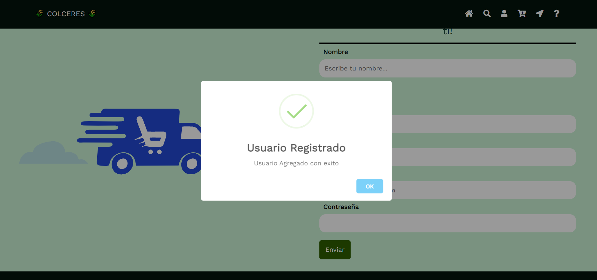

# ColCeres

## Welcome! 👋

Proyecto de desarrollo del Grupo 5 - Ciclo 3 MinTIC 2022

## [Demo](https://learn-frontend-mintic.github.io/ColCeres.github.io/)

# El marketplace online más completo para tus productos

Colceres es una startup que busca conectar a los productores nacionales con las personas de cualquier parte de Colombia 
para que puedan vender sus productos a una gran comunidad nacional y así apoyar su talento.

 ## Proyecto:

* Página Web de Ventas donde los productores nacionales pueden ofertar sus mercancías con una muy baja comisión por venta y conectar con el consumidor el cual encontrará una oferta de productos hechos en Colombia.

## Nombre del Proyecto:

* ColCeres
 
##  Nuestra Propuesta de Valor:

* Proporcionar una plataforma de venta de productos a los usuarios, mediante la cual puedan ofrecer sus productos, con el objetivo de fortalecer la producción nacional con una baja comisión por cada transacción.
Soporte a los usuarios para que puedan solucionar los problemas con la plataforma.
Capacitación a los productores para que puedan conectar de forma eficiente con los clientes potenciales.

## Como generar la confianza con los usuarios:

* Garantía al usuario comprador de que va a recibir un producto de calidad y en caso de no estar satisfecho se le hará devolución del dinero
* Garantía al usuario vendedor de que va a recibir el dinero de la transacción y el cobro de comisión bajo por la venta.
 
## Incentivos:

* Para los usuarios compradores se les ofrecerá un incentivo de gratis después de sus primeras 10 reseñas en la plataforma.
Para el usuario vendedor se equipará con bolsas reciclables para el envío de sus productos después de haber formalizado 10 ventas dentro de la plataforma por semana.

## Como Monetizar:

* Por comisión del 7% por cada transacción mas impuestos.
